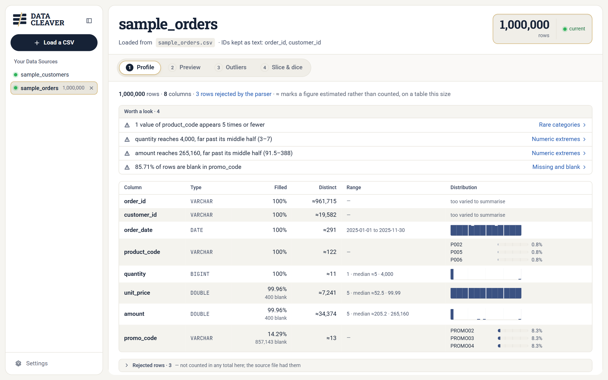
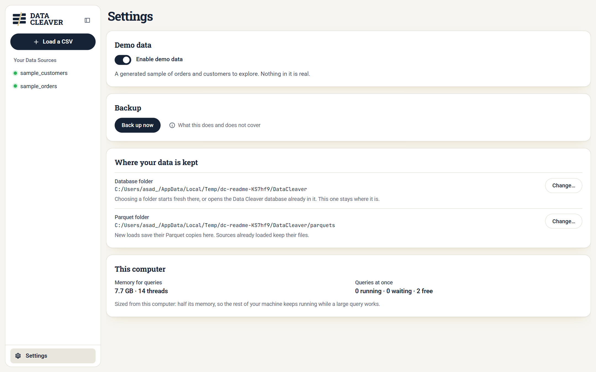
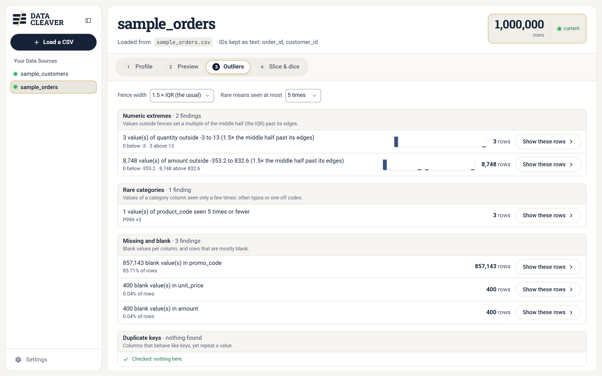
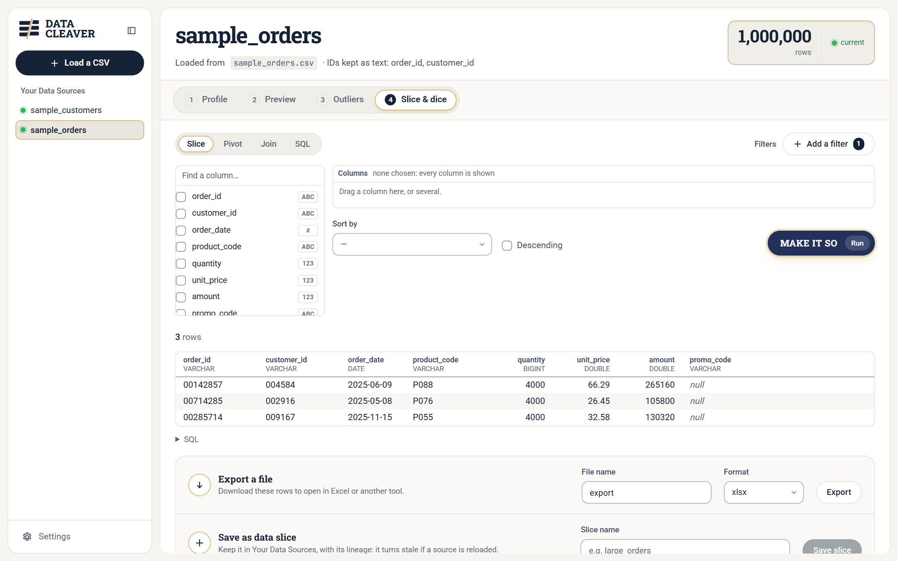
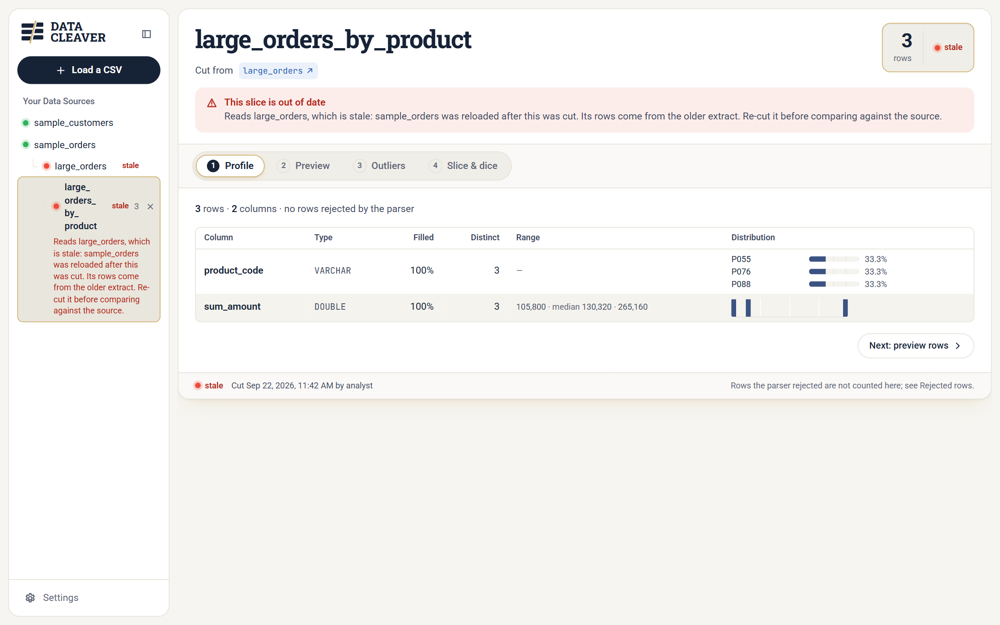
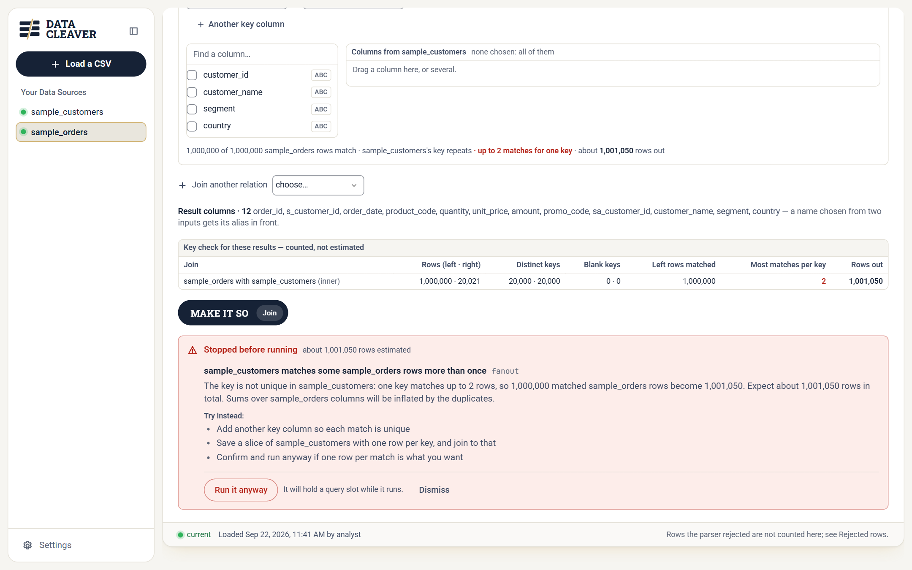

# Data Cleaver

**Excel's final frontier is our starting line.**

Data Cleaver opens CSV files too big for a spreadsheet (hundreds of
megabytes, millions of rows) on your own Windows PC. It walks you through
them the way an analyst would: profile the columns, look at the rows, find
what doesn't fit, then slice, pivot and join. Every result you save remembers
where it came from, and tells you when it has gone out of date.

Nothing leaves your computer. There's no server to set up, no account, and no
upload.



<!-- OWNER: a sentence or two in your own voice on why you built it, e.g. the
     file that Excel gave up on. The rest of this page is facts. -->

## Get it

1. Download **`DataCleaver-Setup.exe`** from the
   [latest release](../../releases/latest).
2. Run it. The installer isn't code-signed, so Windows SmartScreen may say
   *"Windows protected your PC"*. Click **More info**, then **Run anyway**.
3. Setup installs for your user only. It doesn't ask for administrator
   rights.
4. Open **Data Cleaver** from the Start menu. The first launch prepares a
   sample dataset of one million rows, which takes about 15 seconds. You can
   turn it off, or back on, in **Settings → Enable demo data**.

It needs 64-bit Windows 10 (version 1809 or later) or Windows 11. It uses
Microsoft Edge WebView2, which Windows 11 already has. On an older Windows 10
the app tells you if it's missing and where to get it.



## The path through a file

Every file you open gets the same four steps. They're a suggestion, not a
gate: jump to any step at any time.

**1. Profile.** What's in the file: each column's type, how much of it is
filled in, how many distinct values it has, its range and a small
distribution. Rows the parser couldn't read are listed here too. Leads worth a
look are pulled to the top.

**2. Preview.** The rows themselves: the first rows as stored, or a repeatable
random sample, sortable by any column.

**3. Outliers.** What doesn't fit, as a list of exceptions:
- numbers far outside the middle of their range, with fences you can widen;
- rare categories;
- blank values;
- key columns that repeat.

Each finding opens exactly the rows behind it.



**4. Slice & dice.**
- **Slice:** filter rows with conditions that read as sentences ("quantity
  more than 20"), and pick columns by dragging them into place.
- **Pivot:** summarise by the rows and columns you choose.
- **Join:** combine two files. The key columns are checked before anything
  runs.
- **SQL:** write your own query, with column names completed as you type.

Run is labelled **Make it so**, with the plain action always written beside
it.



Save any result as a table, or export it as `.xlsx`, `.csv` or Parquet.

## Why saved results say when they're stale

Suppose you save a slice, then reload the file it came from with next
month's export. The slice still holds last month's rows, and nothing about it
looks wrong.

Data Cleaver records what every saved result was cut from, and when. If any
input is reloaded or re-cut afterwards, however many steps back, the result
is marked **stale** and says why. If it can't tell (for example, a result
saved from hand-written SQL that doesn't record its inputs), it says
**unchecked** rather than guessing.



## It won't quietly change your data

- **IDs stay as text.** Account and order numbers like `000123` lose their
  leading zeros if they're read as numbers, and nothing gets them back.
  Columns that look like IDs are ticked to be kept as text before you load.
- **Blank fields are empty, not zero.** An empty field loads as a blank
  (NULL), alongside any "no value" marker you set.
- **Bad rows are set aside, never dropped silently.** Rows the parser
  rejects are kept separately and shown in Profile. They aren't in any row
  count, so a total won't match the source file's line count until you
  account for them.
- **A join that would multiply rows asks first.** If one key matches more
  than one row, the join stops, shows how many rows it would produce, and
  lets you add a key column or run it anyway.



## Your data

- Data Cleaver reads only from folders you add (**Load a CSV → Choose
  folder…**).
- Each CSV is converted once to Parquet, a compact columnar format, so later
  queries are fast.
- Everything it creates is kept in `%LOCALAPPDATA%\DataCleaver` by default:
  the database, the Parquet copies, the sample data and your settings. In
  **Settings** you can choose other folders for the database and the Parquet
  copies; a new database folder starts fresh, and the old database stays
  where it was.
- Uninstalling removes the program and leaves that folder alone. Delete it
  yourself to remove your data too.

## Build it yourself

Needs Python 3.14 and Node 22, on Windows.

```
python -m venv .venv
.venv/Scripts/python -m pip install -r sda/backend/requirements-dev.txt
cd sda/frontend && npm ci && npm run build && cd ../..
.venv/Scripts/python sda/desktop/launch.py
```

For development, run the backend and Vite's dev server separately:

```
cd sda/backend  && ../../.venv/Scripts/python -m uvicorn app.main:app --workers 1 --port 8000 --reload
cd sda/frontend && npm run dev
```

Tests: `python -m pytest -q` in `sda/backend`. In `sda/frontend`, `npm test`
runs the unit tests and `npm run test:a11y` audits every view with axe. The
installer build is in [`sda/desktop/README.md`](sda/desktop/README.md).

## How it's built

- **The app:** a single local process, listening only on `127.0.0.1`.
  - FastAPI over [DuckDB](https://duckdb.org) runs the queries.
  - A React and TypeScript UI is shown in a native window through pywebview.
- **Queries:**
  - Queries run as jobs you can watch and cancel, so a long one never freezes
    the window.
  - Every query passes a gateway before it runs. Hand-written SQL must be a
    single read-only `SELECT`, and file reads stay inside your folders.
  - Expensive queries say so before they run.
- **Lineage:** three registry tables sit beside the data. `_sources` records
  loads, `_lineage` records saved results and their inputs, and `_rejects`
  records bad rows. Staleness is computed from them every time the list is
  shown.
- **Accessibility:** the UI targets WCAG 2.1 AA. The accessibility suite
  runs in CI and fails the build if any view gets worse.

Data Cleaver's working name was SDA (Slice, Dice and Analyze), which is why
the code lives in `sda/`.

## Licence

MIT. See [LICENSE](LICENSE).
